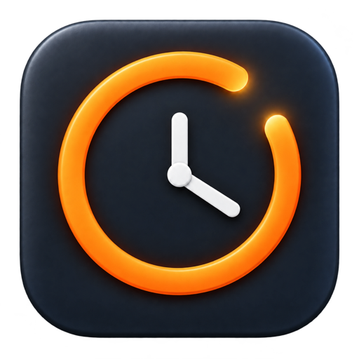

# BreakBar

<p align="center">
  
</p>

[](https://github.com/allenhutchison/breakbar/actions/workflows/ci.yml)
[](LICENSE)

BreakBar is a Mac-first menu-bar countdown that makes regular breaks hard to ignore. It works without external hardware; optional accessories can mirror the current state and send the same typed commands as the Mac UI.

## Download

Signed and notarized builds are published on the [BreakBar releases page](https://github.com/allenhutchison/breakbar/releases/latest). BreakBar checks that release channel automatically, verifies downloaded archives with a dedicated EdDSA signature before extraction, and installs updates when it is ready to relaunch. You can also check immediately from the circular-arrows button in the menu-bar popover or from Settings. BreakBar currently supports Apple Silicon Macs running macOS 14 or later.

The project website is published at [allenhutchison.github.io/breakbar](https://allenhutchison.github.io/breakbar/).

## Run the app

The current slice requires macOS 14 or newer and Swift 6.

```sh
make run
```

For a one-minute focus cycle, 15-second warning, and 20-second minimum break:

```sh
make demo
```

The app launches quietly in the menu bar, where its status item shows the live countdown; Settings opens only when selected from the gear button. Clock in, let the countdown reach the warning window, and allow notifications when macOS asks. The warning posts one notification and plays a sound. At zero, start the break from the full-screen prompt, or choose **5 more minutes** in normal mode (**15 more seconds** in demo mode) to dismiss the prompt and begin a fresh warning. Break-return and activity prompts open centered in the current screen's visible area. Starting a break makes a best-effort request to launch the macOS screensaver; returning to focus remains unavailable until the minimum break has elapsed.

Open **Settings** from the menu-bar menu to change the focus interval, warning duration, minimum break, and idle-away threshold. Each timing control accepts a two-digit minute value or can be adjusted with its adjacent arrows. Invalid values are clamped to the supported range, and normal-mode preferences persist across app restarts. Use **Restore timing defaults** to return to the standard 55-minute focus, 5-minute warning, 5-minute minimum break, and 10-minute idle threshold. Timing controls are unavailable in demo mode so its accelerated cycle remains unchanged.

When activity resumes after the Mac has been idle for the configured threshold while BreakBar is clocked out, a one-time **Ready to work?** prompt offers to clock in. Choosing **Not yet** dismisses the prompt until another qualifying idle-and-return cycle; BreakBar never backdates the clock-in time.

Connect and select calendars in **Settings** to let BreakBar plan around meetings, lunch, and travel. Lunch matching is case-insensitive and requires `Lunch` as a complete word in the event title, so a title such as `Lunchroom planning` does not match. BreakBar prompts at the event start without automatically changing your activity; choose **Start lunch** to pause break enforcement or **Keep working** to dismiss that occurrence. If an unclassified idle interval overlaps lunch, the return prompt marks Lunch as the suggested classification.

Open **Today’s history** from the chart button in the menu-bar popover to see clocked-in time, working time, category totals, and the day’s activity timeline. Ongoing intervals update in place, and activity crossing midnight is counted only within the current local day. Calendar, detected-call, manual, and offsite meetings are recorded separately from focus time. Select the active work session to correct its clock-in time; if its initial focus interval is still active, the countdown is recalculated from the corrected start. Completed work sessions allow both clock-in and clock-out corrections, and completed timeline entries allow category, start-time, and end-time corrections. BreakBar rejects invalid or overlapping times, adjusts boundary activities when session times change, recalculates the summary immediately, and marks corrected entries as edited.

To export that ledger into Obsidian, choose the daily-notes folder and note-path date format in **Settings → Obsidian**. The format may include date-based subfolders such as `yyyy/MM/yyyy-MM-dd`; literal path segments containing ASCII letters must be wrapped in single quotes, as in `'Daily'/yyyy/MM/yyyy-MM-dd`, because unquoted letters are interpreted as date-format symbols. BreakBar keeps the resulting path inside the selected folder and adds the Markdown extension. It creates or replaces only the section delimited by `<!-- breakbar:start -->` and `<!-- breakbar:end -->`, preserving the rest of the note. Export runs after clock-out and history corrections, and can be retried from Settings or Today’s history. A malformed or duplicated marker pair stops the export instead of risking unrelated note content. Export failures never roll back timer or history changes, and demo-mode history cannot be exported into normal daily notes.

An event whose title contains `Travel`, `Commute`, or `Drive` starts a travel chain; a physical event location marks an offsite meeting, and an ordinary meeting between outbound and return travel blocks is treated as offsite too. BreakBar shows a five-minute `Leave` countdown with a notification and sound, then a `TIME TO GO` overlay at departure. Break enforcement remains paused through the connected offsite chain, and BreakBar stays `AWAY` after it ends until **Return home / resume focus** starts a fresh focus cycle. Calendar titles are used for classification but are not stored in timer state or history.

## Verify

```sh
make test
make build
```

## Contributing

Issues and feature discussions are welcome. BreakBar is maintainer-directed:
do not open a pull request unless the maintainer has explicitly approved the
implementation in a linked issue. Unsolicited pull requests will likely be
closed without review; independent changes should be maintained in a fork.
Read [CONTRIBUTING.md](CONTRIBUTING.md) for the full policy and development
workflow. Report security and privacy vulnerabilities privately according to
[SECURITY.md](SECURITY.md).

## Release

Public builds are created by the `Release` GitHub Actions workflow. It builds the release configuration, embeds and signs Sparkle's updater helpers with the Developer ID Application certificate, enables the hardened runtime, submits the app to Apple for notarization, staples the resulting ticket, and publishes `BreakBar.zip`, its SHA-256 checksum, and an EdDSA-signed `appcast.xml` to GitHub Releases.

The release workflow requires the repository secrets documented in [the release guidelines](.claude/guidelines/release.md). It intentionally does not publish an unsigned fallback.

The Makefile selects the installed Xcode beta because this machine’s currently selected standalone Command Line Tools contain a compiler/SDK mismatch. Override `DEVELOPER_DIR` when a stable matching Xcode is selected.

## Architecture

- `BreakBarCore` contains the deterministic state machine, policy, presentation model, and accessory protocol. It has no UI or hardware dependency.
- `BreakBarPersistence` owns the migration-capable SQLite session ledger and recoverable state snapshot. Timer transitions commit there before the UI publishes them.
- `BreakBarExport` renders correction-aware daily history and safely replaces BreakBar’s marked Markdown section.
- `BreakBarApp` is the always-available Mac presentation/input implementation and integrates Sparkle for signed updates.
- A future BUSY Bar target will conform to `BreakBarAccessory` after its shipping API has been validated.

Normal and demo runs use separate databases under BreakBar’s Application Support directory, so accelerated cycles never enter real work history. Existing `state.json` state is imported once when the normal SQLite database is first created and retained as a recovery artifact.

The broader product design is in [planning/BreakBar V1 Design.md](planning/BreakBar%20V1%20Design.md).

## License

BreakBar is available under the [MIT License](LICENSE). Third-party components
retain their own licenses.
